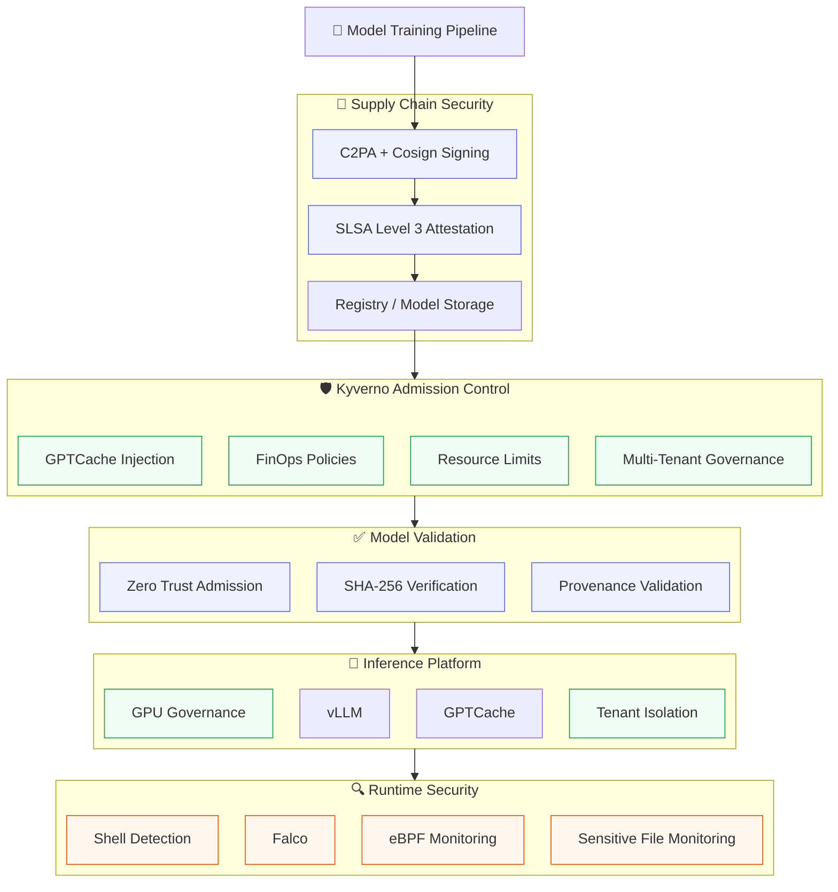

# 🤖 AI-Governance-Platform

<div align="center">

### Enterprise AI Governance Platform for Kubernetes

**AI FinOps • Supply Chain Security • Policy-as-Code • Runtime Threat Detection**

[]()
[]()
[]()
[]()
[]()

---

### Zero Trust Architecture for Generative AI Workloads

*Secure by Default • Governed by Policy • Optimized by Design*

</div>

---

## 📖 Executive Summary

Generative AI workloads introduce challenges that traditional cloud-native platforms were not designed to address.

This platform implements a complete governance layer for AI workloads running on Kubernetes, combining security, cost optimization, policy enforcement, model provenance validation and runtime threat detection.

### Key Challenges

- 💸 Uncontrolled GPU spending
- 🔓 Model tampering and supply chain attacks
- ⚠️ Lack of governance across teams
- 🕵️ Runtime threats and privilege escalation
- 📉 Limited visibility into AI infrastructure costs

### Solution

AI-Governance-Platform automatically:

- Validates model provenance before execution
- Enforces FinOps policies
- Injects transparent optimization layers
- Detects runtime threats using eBPF
- Enables multi-tenant AI operations

---

## 🏗️ Architecture Overview


## 🔐 Security Layers

### Layer 1 — Supply Chain Security

| Control | Technology | Purpose |
|----------|------------|----------|
| Provenance | C2PA | Verify model origin |
| Integrity | SHA-256 | Detect model tampering |
| Signing | Cosign | Cryptographic trust |
| Attestation | SLSA Level 3 | Pipeline provenance |

---

### Layer 2 — Admission Governance

| Control | Technology | Purpose |
|----------|------------|----------|
| FinOps | Kyverno + CEL | GPU governance |
| Limits | ValidatingPolicy | Resource enforcement |
| Mutation | MutatingPolicy | GPTCache injection |
| Isolation | NetworkPolicy | Multi-tenant security |

---

### Layer 3 — Runtime Security

| Control | Technology | Purpose |
|----------|------------|----------|
| Runtime Detection | Falco | Threat detection |
| Visibility | eBPF | Kernel telemetry |
| Metrics | Prometheus | Monitoring |
| Dashboards | Grafana | Operational insights |

---

## 🚀 Core Capabilities

### 💰 AI FinOps

Policy-based governance for GPU workloads.

**Examples**

- Block premium GPUs in development
- Enforce GPU limits
- Control tenant quotas
- Prevent resource abuse

**Result**

- Reduced infrastructure waste
- Better GPU utilization
- Predictable operational costs

---

### ⚡ Transparent Optimization

Automatic GPTCache injection without application modifications.

```text
Deployment
     │
     ▼
Kyverno detects vLLM
     │
     ▼
Inject GPTCache Sidecar
     │
     ▼
Cache Hit Rate ≈ 40-60%
```

**Benefits**

- Lower latency
- Reduced GPU consumption
- Higher throughput

---

### 🔒 Zero Trust Model Validation

Every model must prove its authenticity before execution.

```text
Model Request
      │
      ▼
Download Manifest
      │
      ▼
Calculate SHA-256
      │
      ▼
Compare Hashes
      │
 ┌────┴────┐
 │         │
 ▼         ▼
MATCH   MISMATCH
 │         │
 ▼         ▼
ALLOW   BLOCK
```

---

### 🛡️ Runtime Threat Detection

Continuous monitoring of inference workloads.

Detected events:

- Unauthorized shell execution
- Sensitive file access
- Privilege escalation attempts
- Suspicious process spawning
- Runtime tampering indicators

---

## 🧪 Security Validation

### FinOps Governance

Attempt:

```bash
kubectl apply -f workloads/abusive/inference-premium-dev.yaml
```

Result:

```text
DENY

FinOps violation:
dev/staging cannot request premium GPUs
```

---

### GPTCache Injection

Command:

```bash
kubectl get deployment vllm-standard \
-o jsonpath='{.spec.template.spec.containers[*].name}'
```

Result:

```text
vllm gptcache-sidecar
```

---

### Model Tampering Attack

Attack Simulation:

```text
Attacker replaces:
model.safetensors

Keeps:
model.c2pa.json
```

Validator Output:

```text
Expected Hash:
ca4e344857c6a8cb...

Calculated Hash:
318f846a64d6254b...

FAIL:
Model integrity violation detected
```

Result:

```text
Init:Error

Pod never reaches runtime
```

✅ Attack successfully blocked

---

### Runtime Threat Detection

Attack Simulation:

```bash
cat /etc/shadow
```

Falco Alert:

```text
Sensitive file opened for reading by non-trusted process

File: /etc/shadow
Process: cat
Namespace: team-mlops
```

✅ Runtime threat detected

---

## 📊 Validated Outcomes

| Capability | Status |
|------------|---------|
| AI FinOps | ✅ |
| GPTCache Injection | ✅ |
| Multi-Tenant Governance | ✅ |
| Model Provenance Validation | ✅ |
| Runtime Threat Detection | ✅ |
| Supply Chain Security | ✅ |
| Zero Trust Admission | ✅ |

---

## 🛠️ Technology Stack

### Platform

- Kubernetes 1.31
- Kind
- Docker

### Governance

- Kyverno 1.18
- CEL Policies

### AI Inference

- vLLM
- GPTCache
- Redis

### Supply Chain Security

- C2PA
- Cosign
- SLSA Level 3

### Runtime Security

- Falco
- eBPF

### Observability

- Prometheus
- Grafana
- DCGM Exporter

---

## 🎯 Business Outcomes

- Secure AI workloads by default
- Enforce governance automatically
- Reduce inference costs
- Detect runtime threats
- Enable multi-tenant AI operations
- Establish Zero Trust AI infrastructure

---

## 🏆 Highlights

- ✅ Policy-as-Code with Kyverno + CEL
- ✅ AI FinOps Governance
- ✅ GPTCache Sidecar Injection
- ✅ C2PA Model Provenance Validation
- ✅ SLSA Level 3 Attestation
- ✅ Cosign Image Signing
- ✅ Falco Runtime Security
- ✅ eBPF Threat Visibility
- ✅ Multi-Tenant Kubernetes Architecture

---

<div align="center">

# Platform Engineering for AI

### Secure by Default • Governed by Policy • Optimized by Design

**Zero Trust AI Infrastructure**

</div>
